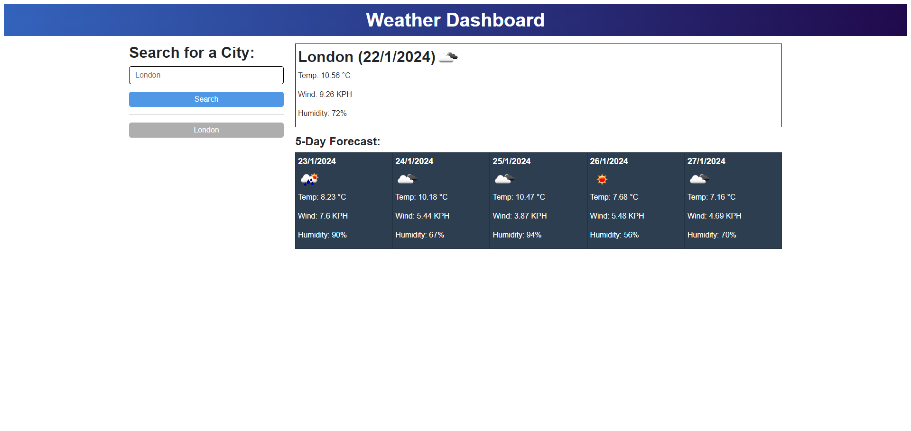
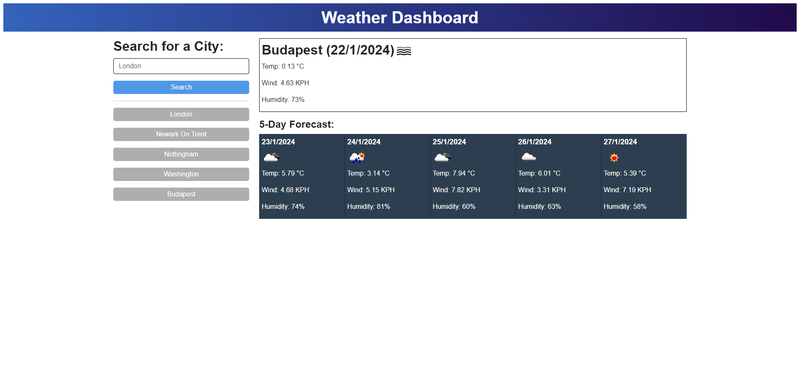

# Weather Dashboard

## Description
This project is a weather dashboard application that allows users to search for a city from anywhere in the world and check the current weather and the 5 days forecast. Each location that's been searched will be stored in the local storage and a button for the location will be generated to make it easier for the user to check the weather anytime.

This application uses three APIs from OpenWeatherMap: 
- 5 day weather forecast API to get the forecast data.
- Current wearher API to get the current weather data.
- Geocoding API to convert the city name to geo coordinates, since both APIs above require latitude and longitude coordinates to get weather data.

## How to use
Type any city name into the search field on the left hand side and click the search button. If a location has already been searched, a button will appear under the search button with the city name for quick access.

## Screenshots

## Links
[Link to the deployed application](https://nyitrai87.github.io/weather-dashboard/)

## Sources
- I used elad2412's CSS reset code: [The New CSS Reset](https://elad2412.github.io/the-new-css-reset/)